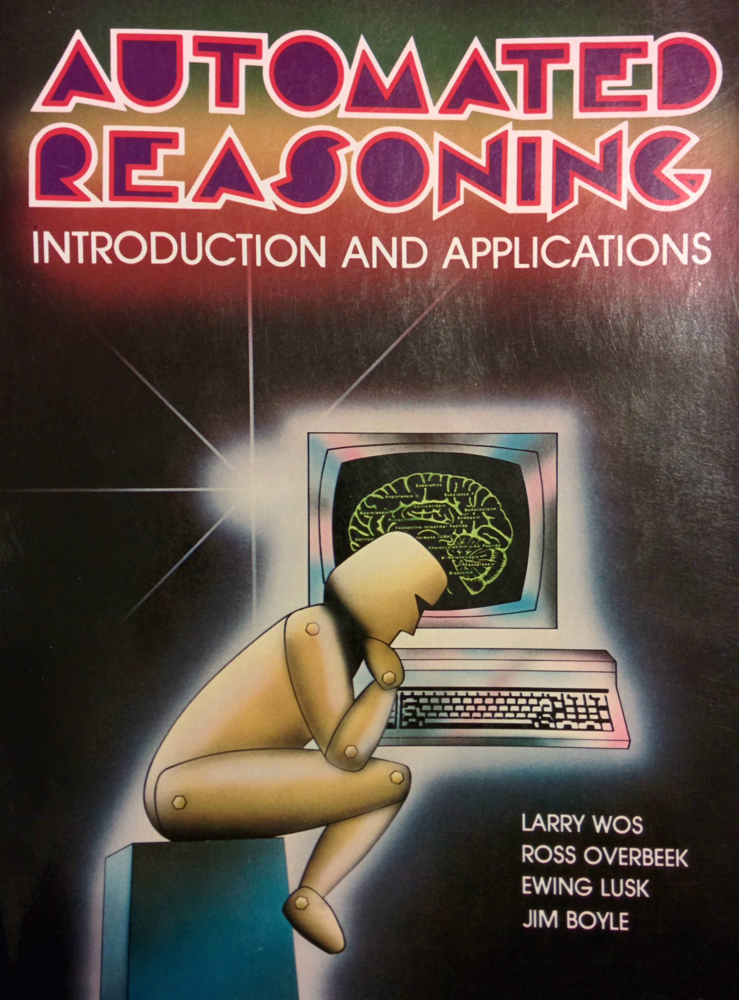

**Part One: Reason**

**A Glimpse of the Future**

On December 10, 1996, the New York Times published an article entitled
“Computer Math Proof Shows Reasoning Power.”[^1] The article followed an
announcement that a computer program had solved an open mathematical
problem, one that had resisted the efforts of logicians for more than
seventy years. The program was called the EQP, for “equational prover,”
and it was designed to prove logical theorems.[^2] Computers had been
used to prove theorems before, as early as the mid-1950s. For the most
part, earlier successes were thought to represent comparatively simple
problem-solving or mere brute force case checking. But this program,
according to its primary architect William McCune, represented a
“quantum leap forward”—it exhibited *reasoning* power.[^3]

McCune and his colleagues at the Argonne National Laboratory had a
vision of mathematics in which computers would not be mere *tools* for
mathematical research but would rather become *agents* of mathematical
research; “colleagues,” “mentors,” “co-workers,” or “collaborators.”[^4]
They would be able to acquire and exhibit those faculties, like
reasoning, that constituted mathematical work.

But what was the character of *reasoning*—that most mathematical of
faculties—that the EQP was said to have exhibited? The EQP’s
accomplishment was officially announced first in the *Journal of
Automated Reasoning* – the flagship of an eponymous research field that
developed through the late 1960s.[^5] The field was developed in
opposition to the better-known research domain of Artificial
Intelligence. The latter sought to simulate *human* reasoning by
computer. Practitioners of automated reasoning, on the other hand,
wanted to explore the possibility of new forms of reasoning in which
computers could in fact *surpass* people, rather than simulate them. In
imagining a computer-inclusive vision for the future of mathematics,
McCune and his colleagues forged quite new meanings of “reasoning”
itself.

Cover Art for *Automated Reasoning: Introduction
and* *Applications*, authored by L. Wos, R. Overbook, E. Lusk, J.
Boyle from the Argonne National Laboratory, 1984.]

**A Glimpse of the Past**

In 1854 English logician George Boole published one of the earliest
texts in modern mathematical logic: [*An Investigation of the Laws of
Thought on Which are Founded the Mathematical Theories of Logic and
Probabilities*](https://books.google.com/books?id=DqwAAAAAcAAJ). The
title of the work is usually abbreviated to *The Laws of Thought*, but
the rest matters too. Boole intended to “investigate the fundamental
laws of those operations of the mind by which reasoning is performed”
and “to give expression to them in the symbolic language of a
Calculus.”[^6] For Boole, the field of logic—the study of what follows
from what—would be *founded* on those laws of human thinking. The rules
of thought would be the laws of logical inference.

The development of logic became particularly important for late
nineteenth century mathematics. At that time, there was growing concern
that mathematical knowledge might be inconsistent and rife with
contradictions. These sentiments emerged in part because of the
discovery of certain paradoxes within mathematics, especially set
theory. It also emerged as mathematicians became increasingly dispersed
among subfields of research that often adhered to different standards
and did not speak to one another.[^7]

In order to salvage their discipline from these troubling contradictions
and diffusions, some mathematicians set out in search of new foundations
that could be used to standardize and rebuild mathematics from the
bottom up, eliminating the possibility of paradox and providing step by
step justification for mathematical truth claims. Many believed that
*logic*, understood as the science of deduction, grounded on the laws of
human reasoning, was the best possible such foundation.

Many attempts to represent the basic units of human reasoning within a
formal deductive system followed Boole’s. Gottlob Frege published his
*Begriffsschrift: Eine der arithmetischen nachgebildete Formelsprache
des reinen Denkens* in 1879. Like Boole, Frege attempted to craft a
formalized “concept notation,” a language of *pure thought*, modeled
upon that of arithmetic. Later, two British mathematicians, Alfred North
Whitehead and Bertrand Russell, would work within such a logical system
to construct proofs of all existing results from the branches of
mathematics.

They were after a “complete enumeration of all ideas and steps in
reasoning employed in mathematics.”[^8] Their proofs would make their
resulting conclusions *certain* because they would be constructed
according to the supposedly self-evident steps and primitive ideas that
constituted human thinking.[^9] Primitive notions like “disjunction” and
“negation,” borrowed from natural language, were given a mathematical
formalization. From these were crafted primitive propositions, for
example, “Anything implied by a true elementary proposition is true” and
“if *q* is true then ‘*p* or *q’* is true.” These primitive propositions
were the basic building blocks from which proof would be
constructed.[^10] Mathematics, formulated this way, would be founded on
logic. Logic would in turn be founded on the laws of human reasoning
that Boole, Frege, Russell and Whitehead, and others sought to distill.
These laws would also offer what seemed like a perfect recipe for the
creation of “thinking machines” – if computers could be made to execute
the laws of deduction, touted by logicians as the laws of thought
itself, would they not be thinking?

**A Future Failed**

The question of whether or not machines could think long predated the
advent of modern digital computing, coming in many forms alongside
changing theories and experiences of machines and minds.[^11] But with
computers, that dream seemed more possible than ever. And mathematical
logic seemed an especially attractive problem domain in this regard. For
one thing, computers are exemplary rule-followers – they can only do
what they can be explicitly instructed to do according to a finite set
of executable rules. Logic came with a ready-made formal calculus of
explicit axioms and rules of inference. Moreover, this formal
infrastructure, as we have seen, was designed to capture the most basic
elements of human thinking itself. If computers could follow these “laws
of thought” they would be able to prove theorems, and in so doing
exhibit one of the faculties most closely associated with human
intelligence. It is not surprising, then, that logical proof was among
the earliest nonnumeric domains that researchers in the United States
sought to automate following the advent of modern digital computers.

One intuitive approach to the automation of proof would be to provide a
computer with the axioms and inference rules of logic. The computer
could then be programmed to apply the latter to the former in order to
deduce any provable logical consequences. Users could input a logical
proposition and run the computer to see if any permitted sequences of
inference led to that proposition. If so, the series of steps taken by
the program in that sequence would constitute a proof, and the computer
would have deployed the “laws of thought” to solve a mathematical
problem. It didn’t work.

In spite of the incredible speed and efficiency with which computers
(even in the 1950s) could execute instructions, practitioners quickly
discovered that this method of proof-seeking on its own was so
inefficient as to be unusable. Not only did it lead to an *exponential*
explosion of data given how many inferences could be made, but there was
also no way to know when or if a proof would ever be found. Larry Wos,
from Argonne, observed in 1964 that “ if a proof existed of the desired
theorem, it would be captured in the steadily expanding sets of
instances.” However, the “disastrous rate of growth of these set […],
spelled the doom of exhaustive instantiation.”[^12] Simply applying
inference rules to axioms would not, it turned out, enable computers to
prove theorems or to exhibit anything that practitioners recognized as
intelligent, thinking behavior.

In light of this realization, research in the automation of proof turned
towards the development of strategies for more efficient search.
Practitioners each adopted different strategies, motivated by particular
visions of the computer, its limitations and its possibilities for
future mathematical work. Some believed that the “laws of thought” from
nineteenth century logic in fact didn’t capture how mathematicians
looked for proofs, and set out to discover and then automate *actual*
human theorem-proving practice. Others, however, weren’t interested in
getting computers to do what people do. They wanted to know what
computers could do that people *couldn’t*. What paths of reasoning,
proof, and discovery did computers make possible that were not otherwise
possible?

**Resolution**

One year after Wos published his discouraging remarks about exhaustive
instantiation, John Alan Robinson published a paper called “A Machine
Oriented Logic Based on the Resolution Principle.”[^13] In it, he
introduced what would become one of the most powerful tools for computer
proof, and with it, a new vision for reasoning itself. Robinson, a
classicist and a logician, characterized existing traditions of logical
analysis as follows:

> Traditionally, a single step in a deduction has been required, for
> pragmatic and psychological reasons, to be simple enough […] to be
> apprehended as correct by a human being in a single intellectual act.
> No doubt this custom originates in the desire that each single step of
> a deduction should be indubitable, even though the deduction as a
> whole may consist of a long chain of such steps. […] Part of the
> point, then, of the logical analysis of deductive reasoning has been
> to reduce complex inferences, which are beyond the capacity of the
> human mind to grasp as single steps, to chains of simpler inferences,
> each of which is within the capacity of the human mind to grasp as a
> single transaction.[^14]

What Robinson hit upon was that the study of logic and the study of the
so-called primitive psychological and cognitive elements of human
deduction had been one and the same. For Boole, Frege, Whiteheand, and
Russell, the basic elements of logic were the basic operations of the
human mind.

Robinson saw in computing the possibility for a new logic, one designed
to capitalize on the power of computing for following complex rules
rather than one that accommodated the human minds: “When the agent
carrying out the application of an inference principle is a modern
computing machine, the traditional limitation on the complexity of
inference principles is no longer very appropriate. More powerful
principles, involving perhaps a much greater amount of combinatorial
information-processing for a single application, become a
possibility.”[^15] Robinson did not *lament* the differences between
people and computers – it was precisely in those differences that he saw
an exciting future for mathematics.

Robinson offered one such machine-oriented logic in 1965, grounded on
what he called the “Resolution Principle.” The laws that grounded
human-oriented logics were meant to be clear, in need of no further
justification, like the age-old syllogism: All men are mortal. Socrates
is a man. Therefore, Socrates is mortal. The conclusions of
Resolution-based inference were not so obvious. From the premises (1)
All hounds howl at night; (2) Anyone who has any cats will not have any
mice; (3) Light sleepers do not have anything which howls at night; (4)
John has neither a cat or a hound; Resolution would permit the
conclusion: If John is a light sleeper, then John does not have any
mice.[^16] Resolution was designed precisely *not* to accommodate human
psychology but rather to circumvent it, capitalizing on the speed and
efficiency of computing machines.

Resolution was incredibly powerful, and increasingly it and its
variations were built in to the most powerful theorem-provers of the
second half of the twentieth century, programs like the EQP which was
celebrated as demonstrating “reasoning power” in the New York Times, in
1996. Its “reasoning power” was tied to this transformed view in which
resolution and computer-oriented processes like it counted as reasoning.
In this sense, the human faculty was just an example of a larger
category of “reasoning” rather than the definition of it.

A whole new research field—called Automated Reasoning or Automated
Deduction—emerged in the wake of Resolution’s success. This field was
created in opposition to that more famous discipline, whose visions of
the future are so much more familiar: Artificial Intelligence (AI). AI
practitioners did not recognize Resolution as a step towards their
goals. Reflecting on the history of their field, Argonne practitioners
wrote:

> When [our colleague] submitted a lovely paper on qualified
> hyperresolution to one of the main AI journals, a senior editor did
> not even send it out for refereeing; he just returned a short note
> stating, “the JACM [*Journal of the Association of Computing
> Machinery*] is still publishing such papers, although I don’t know
> why.” This last phrase symbolized the broader AI community in our
> eyes. Like perceptrons, formal logic had […] been evaluated and found
> lacking.[^17]

Artificial Intelligence sought to make computers like people. Automated
Reasoning sought to find problem-solving paths that would be
inaccessible to humans, to open up reasoning and logic themselves, to
untether them from the laws of human thought. Part of the criticism from
AI, and others, concerned the fact that Resolution and tools like it,
took mathematical proof further and further from human view, displacing
the indubitable clarity and understanding that earlier logical systems
had tried to provide.

The problem that the EQP solved in 1996 when its “reasoning power” was
announced in the New York Times concerned none other than Boolean Logic,
the formal system developed out of *An Investigation of the Laws of
Thought, on which are Founded the Mathematical Theories of Logic and
Probabilities*. The problem, called Robbins’ Conjecture, was part of an
ongoing project to find the “simplest” set of axioms for the logical
system, its most basic and primitive ideas. In the 1930s, Herbert
Robbins proposed a new set of three axioms, conjecturing that they were
the simplest sufficient set, but offered no proof. None was found until
the problem was given to the EQP in 1996.[^18] Where logicians, equipped
with their faculties and practices of reasoning, failed for seven
decades, the EQP found a proof within mere minutes.[^19] The computer
program, executing “automated reasoning,” provided new information about
that century old logic that was meant to capture the laws of human
thought but seemed, in this case, to elude them.

[^1]: Gina Kolata, “Computer Math Proof Shows Reasoning Power,” *New
    York Times* (December 10, 1996).

[^2]: The program was developed primarily by William McCune, under the
    directorship of Lawrence Wos within the Applied Mathematics division
    at the Argonne National Laboratory:
    [https://www.cs.unm.edu/\~mccune/eqp/](numbering.xml).

[^3]: Kolata, “Computer Math Proof.” The phrase “reasoning power” is
    attributed to Wos.

[^4]: See, for example, Lawrence Wos, “Solving Open Questions with an
    Automated Theorem-Proving Program” in *6^th^ Conference on Automated
    Deduction* [*Lecture Notes in Computer Science*, Vol. 138] (1982),
    1-31.

[^5]: William McCune, “Solution of the Robbins Problem,” in *Journal of
    Automated Reasoning* 19/3 (1997): 263-276.

[^6]: George Boole, *The Laws of Thought* *on which are founded the
    Mathematical Theories of Logic and Probabilities* (Cambridge, UK:
    Macmillan and Co., 1854), 1.

[^7]: This period has often been called “The Foundations Crisis”,
    following Herman Weyl's publication “über die neue Grundlagenkrise
    der Mathematik,” *Mathematische Zeitschrift* 10 (1921): 39-79.

[^8]: Alfred North Whitehead and Bertrand Russell, *Principia
    Mathematica* Vol. 1 (Cambridge, UK: Cambridge University Press,
    1910), 1.

[^9]: For a clever and insightful criticism of this notion of
    self-evidence in late nineteenth-century logic, see Lewis Carroll,
    “What the Tortoise Said to Achilles,” in *Mind* 4/14 (1895):
    278-280.

[^10]: Whitehead and Russell took these primitive propositions to be
    both self-evident and irreducible. They were more commonly called
    “axioms” in twentieth century logic.

[^11]: See, for example, Margaret Boden, *Mind as Machine: A History of
    Cognitive Science* (Oxford: Oxford University Press, 2006); Phil
    Husbands, Owen Holland, Michael Wheeler, eds. *The Mechanical Mind
    in History* (Cambridge, MA: The MIT Press, 2008).

[^12]: Larry Wos. “The Unit Preference Strategy in Theorem Proving”, in
    *The Collected Works of Larry Wos*, Vol. 1 (Hackensack, NJ: World
    Scientific Publishing Company, 2001), 17-28 [originally *American
    Federation of Information Processing Society*, Proceedings 26
    (1964), 615-621].

[^13]: John A. Robinson, “A Machine-Oriented Logic Based on the
    Resolution Principle,” *Journal of the Association for Computing
    Machinery* 12/1 (1965): 23-41.

[^14]: Robinson, “A Machine-Oriented Logic,” 23.

[^15]: Robinson, “A Machine-Oriented Logic,” 24.

[^16]: This example is borrowed from Gordon S. Novak Jr.: “Resolution
    Example and Exercises,”
    [http://www.cs.utexas.edu/users/novak/reso.html](styles.xml).

[^17]: Ross Overbeek, Ewing Lusk, “Wos and Automated Deduction at ANL:
    The Ethos” in *Automated Reasoning and its Applications; Essays in
    Honor of Larry Wos* (Cambridge, MA: The MIT Press, 1997): 1-12,
    quote on 6.

[^18]: McCune’s presentation of the result and the proof are available
    in “Robbins Algebras are Boolean” (2006 [1996]):
    [https://www.cs.unm.edu/\~mccune/papers/robbins/](stylesWithEffects.xml).

[^19]: The core lemmas of the proof were proved in about 5 seconds and
    2319 seconds respectively. See McCune, “Solution of the Robbins
    Problem,” 274.

