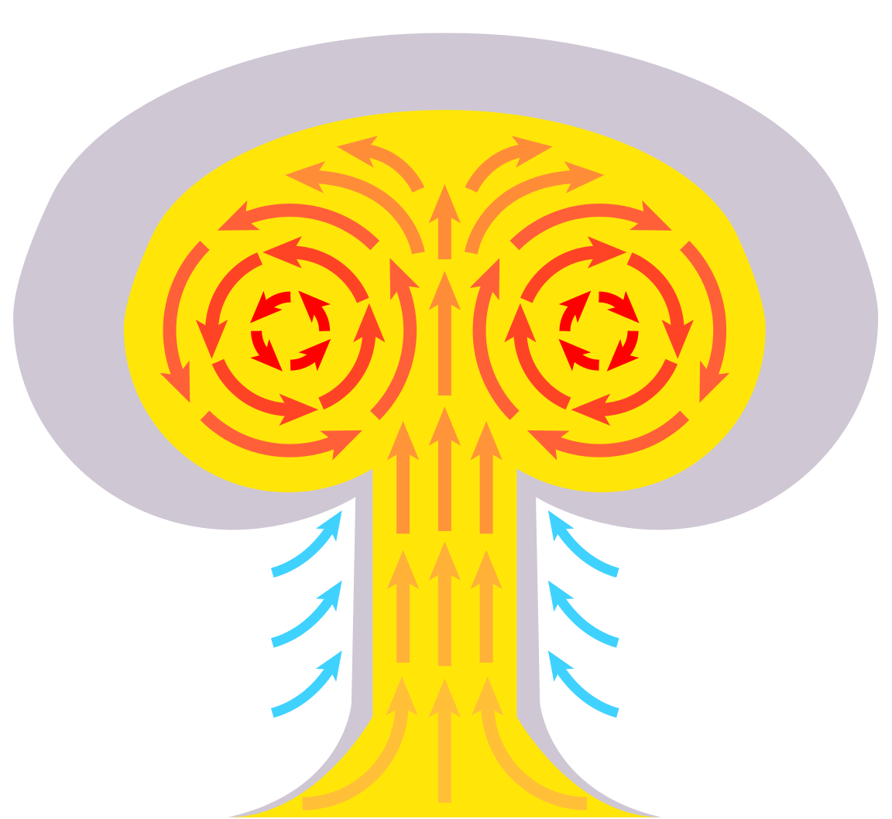

Words fail us when it comes to talking about nuclear war. We can coin
new terms (“megadeaths”), but in other aspects it seems that language
itself breaks down. How can we discuss the impossibly long half-life of
plutonium (24,000 years) or the climatic wintering caused by hurling
millions of tons of particulate matter into the atmosphere — unpleasant
matters, to be sure, but also ones that seem to transcend the human
scales to which our languages are adapted? Another thing: nuclear war
hasn’t happened
([except](http://press.princeton.edu/chapters/s8237.html) for two bombs
detonated over the cities of Hiroshima and Nagasaki in August 1945,
which in today’s parlance would count as a “limited nuclear conflict”).
Talk about global thermonuclear war is speculative. All discussions
about it are, to some degree, fictional, [worlds created out of
language](http://www.freewebs.com/debatabase4/derrida.pdf). In this
essay (and the series that follows it), I am going to take a tour the
future of language in the aftermath of nuclear war, guided by both the
imaginative novels of the past and the contemporary theories of
linguists that were deployed (explicitly or implicitly) in them.

A visual schema of the convection currents of a nuclear
mushroom cloud, a much easier and more predictable rendering than
figuring how to talk about what happens outside and after the cloud.

Before delving into that, I need to clarify what we mean by the
“beginning of the Nuclear Age,” since how one defines beginnings often
heavily structures the kinds of endings one gets (and what is nuclear
war if not an ending and, possibly, a beginning?). Everyone seems to
agree that the [Nuclear
Age](http://blog.nuclearsecrecy.com/2012/08/17/the-end-of-the-nuclear-age/)
began at a definite moment, but without a lot of consensus about when
that was. Was it in December 1938, when Otto Hahn and Fritz Strassmann
announced to the world the splitting of the uranium nucleus? On 2
December 1942, when Enrico Fermi supervised the first nuclear chain
reaction under Stagg Field at the University of Chicago? Other possible
dates include 16 July 1945, with the first nuclear explosion of the
Trinity test in Alamogordo, New Mexico, and 6 August 1945, with the
destruction of Hiroshima.

All of these posited origin moments hover around the physical reality of
nuclear fission and hence nuclear bombs, but we could take a softer
beginning, rolling as far back as the 1914 publication of the book that
coined the term “atomic bomb”: [*The World Set
Free*](http://www.gutenberg.org/files/1059/1059-h/1059-h.htm) by H.G.
Wells (who will return in a later installment of this series). Whenever
the Nuclear Age began — and for now, let’s loosely place it around World
War II — it immediately sparked the imagination, especially on the part
of Americans, about what nuclear war and its aftermath would be like.

There are a lot of ways to refer to nuclear war, and in what follows I’m
being absolutely literal. Not metaphors about loss and apocalypse
(although they might *also* be that), but actual descriptions of nuclear
holocaust and its aftermath — well, as literal and actual as talking
about nuclear war can be. Since any such discussion about the
consequences of thousands of bombs going off is necessarily speculative
(given the evident absence to date of a global nuclear war), people must
contemplate it in analogy to things that have already happened, events
they believe they understand well enough to project into the unknowable.
In my own analysis —which focuses on novels— I mostly ignore nuclear
film, nuclear theater, nuclear sculpture, nuclear painting, and many
other imaginations of the post-apocalyptic. Novels are made of language
and language alone, and it is impossible to talk about them without
constantly confronting the dilemmas of nuclear language. That is my
quarry here. Explicit depictions of nuclear war, explicit discussions of
language.

There’s a pattern to the analogies and frames that authors have used,
and that pattern is *historical*, by which I mean that distinct modes
have assumed currency at different points in time, rising to prominence
at particular moments and then slipping into the background (although
never fading away). Scrolling forward from World War II, I see three
prominent patterns.

The earliest group of novels thought of nuclear weapons as similar to
other weapons. Firebombs on steroids, if you will. (Wells offers an
archetypal example, embedding atomic warfare in the context of aerial
bombardment, which he forecast in *The World Set Free*.) Such depictions
of nuclear war called to mind the obliteration of Dresden spanning
Valentine’s Day, 1945, or the devastation of Tokyo during “Operation
Meetinghouse” on 9-10 March of that same year. In this kind of
articulation, novelists were simply following the nuclear specialists,
the [“wizards of Armageddon.”](http://www.sup.org/books/title/?id=2805)
The first of these nuclear mavens, Bernard Brodie, immediately converted
his [PhD musings about naval
strategy](http://books.google.com/books/about/Sea_power_in_the_machine_age.html?id=dVMSAAAAYAAJ)
(Yale, 1940) to become the earliest visionary of [what came to be called
mutually assured
destruction](http://www.rand.org/pubs/authors/b/brodie_bernard.html). In
[November
1945](http://books.google.com/books/about/The_atomic_bomb_and_American_security.html?id=xoVMAQAAIAAJ).
Years before there was anyone mutual to assure destruction. (That would
happen, or begin to happen, in late August 1949, when [the Soviet Union
detonated](http://us.macmillan.com/books/9780312655426) its first test
device).

With the advent of thermonuclear (hydrogen) bombs, even the most diehard
of the extrapolators from the conventional thought that the nuclear
called for a new mode of analysis. (Brodie soon foresaw what he dubbed
[“the absolute
weapon.”](https://www.osti.gov/opennet/servlets/purl/16380564-wvLB09/16380564.pdf))
There was just no analogy in the extant arsenal, but there might be an
analogy in . . . gambling, union-management struggles, or coaxing your
children into babysitting. Game theory was born in 1944 at the Institute
for Advanced Study in Princeton under the pens of [John Von Neumann and
Oskar Morgenstern](http://press.princeton.edu/titles/7802.html), and was
[transmuted by the late
1950s](http://press.uchicago.edu/ucp/books/book/chicago/W/bo17588566.html)
into a widely applicable — and enduring — tool for mathematicians,
strategists, and economists. (Take, for example, Thomas Schelling, who
won the [2005 Nobel Prize in
Economics](http://www.nobelprize.org/nobel_prizes/economic-sciences/laureates/2005/schelling-bio.html)
for applications of game-theoretic reasoning to just about every feature
of social interaction, including nuclear negotiations, especially in his
path-breaking 1960 book, [*The Strategy of
Conflict*](http://www.hup.harvard.edu/catalog.php?isbn=9780674840317).
The nuclear imaginary is muted here, but it is never absent.) [Herman
Kahn](http://www.hup.harvard.edu/catalog.php?isbn=9780674017146), of the
RAND corporation in Santa Monica, California, can stand as a
representative for this second line, albeit an idiosyncratic exemplar
more devoted to systems analysis than game theory proper. Such thinkers
served as models of characters or even plotlines for a certain subset of
novels, and in those, we can read nuclear war through matrix-rimmed
glasses.

Strongly speculative nuclear literature formed a third path alongside
these first two clusters of nuclear imaginaries, and it forms the
primary source base for these essays. This genre is predominantly, but
not exclusively, Anglophone, with a heavy concentration in the United
States. (I have my suspicions about why this is so, which will manifest
in due course.) Since we will predominantly be traveling during the high
days of [Cold War
rationality](http://press.uchicago.edu/ucp/books/book/chicago/H/bo16160491.html),
a time where classification in both major senses was all but obligatory,
let’s break down this third, and last, category, into four general
domains:

a\) *Flashpoint*: These novels are essentially thrillers, chronicling the
break-out and unfolding of nuclear war, or the near-miss of a complete
apocalypse, or the reduction of what could have been the End Of The
World into “merely” a limited nuclear destruction. Exemplary here are
Robert Colborn’s [*The Future Like a
Bride*](http://books.google.com/books/about/The_Future_Like_a_Bride.html?id=XXvqngEACAAJ)
(1957), Peter Bryant’s [*Red
Alert*](https://books.google.com/books?id=BsQujWhUll0C&dq=bryant+red+alert&hl=en&sa=X&ei=OfmiVJ2NKcKfyATE74CQAw&ved=0CDMQ6AEwAw)
(1958), Eugene Burdick and Harvey Wheeler’s
[*Fail-Safe*](https://books.google.com/books?id=GaYTjuz_1jAC&printsec=frontcover&dq=fail-safe&hl=en&sa=X&ei=WPmiVKOeF4qyyQSN1YKgAw&ved=0CB8Q6AEwAA#v=onepage&q=fail-safe&f=false) (1962), and William Prochnau’s [*Trinity’s Child*](http://books.google.com/books/about/Trinity_s_Child.html?id=zd0SDlG-1I0C)
(1983).

b\) *Shelter*: Such novels focus on short-term survival in the wake of
thermonuclear destruction. To set a somewhat arbitrary limit, these
novels focus on the first five years, and explore how people attempt to
hold together the structures of civilization as those teeter and (often)
fall — the greatest threat being vigilantes rather than
radiation-induced birth-defects. Here I would point to Philip Wylie’s
[*Tomorrow!*](http://www.nebraskapress.unl.edu/product/Tomorrow,674149.aspx)
(1954) and [*Triumph*](http://www.nebraskapress.unl.edu/product/Triumph,673252.aspx) (1963), Nevil Shute’s [*On the Beach*](https://books.google.com/books?id=p24G5ZeTfJUC&printsec=frontcover&dq=on+the+beach&hl=en&sa=X&ei=b_miVMT4I4OjyQTqrYDoCw&ved=0CB8Q6AEwAA#v=onepage&q=on%20the%20beach&f=false) (1957), Pat Frank’s [*Alas, Babylon*](https://books.google.com/books?id=Fh9Bi3-09-cC&printsec=frontcover&dq=alas+babylon&hl=en&sa=X&ei=hvmiVIOSMMuoyATC6ICoAw&ved=0CCgQ6AEwAA#v=onepage&q=alas%20babylon&f=false) (1959), Mordecai Roshwald’s [*Level 7*](http://uwpress.wisc.edu/books/3624.htm) (1959),
and Whitley Strieber and James W. Kunetka’s [*Warday*](https://books.google.com/books?id=5__xRIfVzfEC&q=warday+kunetka&dq=warday+kunetka&hl=en&sa=X&ei=rvuiVIScMommyQTi6oGADg&ved=0CB0Q6AEwAA) (1985).

c\) *Sepia*: Nuclear war is long past, but not forgotten. A few
generations (say, 25 to 75 years) have gone by, but there are those
alive who remember what the world was like before the cataclysm, or at
least who have heard about it firsthand from survivors. The antediluvian
world has shifted into a haze of nostalgia or condemnation, and
individuals attempt to piece together a new world rather than save the
old. This is a very large genre, including Leigh Brackett’s [*The Long
Tomorrow*](http://yellowedandcreased.wordpress.com/2011/07/15/the-long-tomorrow-leigh-brackett/)
(1955), Kim Stanley Robinson’s [*The Wild
Shore*](http://www.kimstanleyrobinson.info/index.php?option=com_content&view=article&id=58)
(1984), and David Brin’s [*The
Postman*](http://www.randomhouse.com/book/18362/the-postman-by-david-brin)
(1985), Denis Johnson’s
[*Fiskadoro*](http://www.harpercollins.com/9780060976095/fiskadoro)
(1985), and Cormac McCarthy’s [*The
Road*](http://www.randomhouse.com/book/110490/the-road-by-cormac-mccarthy/9780307472120/)
(2006).

d\) *Epic*: These novels explore the *longue durée*, typically a few
hundred to a few thousand years after thermonuclear war, when
essentially all that remains of our contemporary civilization are ruins
that the novel’s characters have to struggle around. These texts veer
closest into the classic science fiction of space opera or fantasy epic,
since readers need to be introduced to a whole new world: William M.
Miller, Jr.’s [*A Canticle for
Liebowitz*](http://www.harpercollins.com/9780060892999/a-canticle-for-leibowitz)
(1959), Robert Heinlein’s [*Farnham’s
Freehold*](http://books.google.com/books/about/Farnham_s_freehold.html?id=I7gfAQAAIAAJ)
(1964), Russell Hoban’s [*Riddley
Walker*](http://www.ocelotfactory.com/hoban/riddley.html) (1980), Paul
O. Williams’s [*The Breaking of
Northwall*](http://www.nebraskapress.unl.edu/product/Breaking-of-Northwall,672964.aspx)
(1980), and Poul Anderson’s [*Orion Shall
Rise*](https://books.google.com/books?id=Az7x2kyMD_4C&dq=orion+shall+rise&hl=en&sa=X&ei=W_uiVMaaG4eOyATXroGwAw&ved=0CDAQ6AEwAQ)
(1983).

There is a lot of bleed between these categories. *Farnham’s Freehold*,
for example, is both a Shelter and an Epic, while Brendan DuBois sets
his [*Resurrection
Day*](http://books.google.com/books/about/Resurrection_Day.html?id=7rxXNWIERBEC)
(1999) in the temporal aftermath of Shelter novels but the book is
structurally a Flashpoint narrative. And although William Golding’s
classic [*The Lord of the Flies*](https://books.google.com/books?id=2wNNMdkaB34C&printsec=frontcover&dq=lord+of+the+flies&hl=en) (1954) takes place
in the immediate aftermath of a nuclear war, his protagonists being
children shifts the story closer into Sepia in terms of genre.
Nonetheless the general pattern is useful. In the essays that follow, I
will concentrate for the most part on Sepia and Epic novels, because
their temporal setting and duration lend themselves to discussion of
language.

Although not always front and center. When reading through these novels,
many times language is only an afterthought, or an incidental plot
device. Language is simply not what most authors are *thematically*
preoccupied with. Instead, they pose two general questions:

*Is mankind irreducibly evil? In the vein of original sin, are we
condemned to an inexorable path toward technological destruction powered
by intellectual hubris?*

*How do we preserve old knowledge and create new knowledge without the
structures of contemporary civilization?*

These are fascinating themes, no question, and the novels in question
discuss these directly and indirectly in profound ways. In creating
worlds that allow explorations of such complex questions, authors
sometimes reference the linguistic background against which — and,
sometimes, through which — the plot unfolds. If language comes up
explicitly, it is often casually, as an afterthought. In this, it is
almost like the earlobes and cufflinks in a classic oil painting, to use
the analogy described in a classic essay by [Carlo
Ginzburg](https://jhupbooks.press.jhu.edu/content/clues-myths-and-historical-method):
a telltale sign where the author’s views are expressed nakedly,
precisely because they are less deliberate. This allows me to explore
how the theories developed within the science of linguistics of the day
helps us understand the changing contexts of production of these novels,
and in turn how these novels help us understand the historical evolution
of postwar linguistics.

Language is intimately linked to time, especially in Sepia and Epic
texts. Outside this admittedly esoteric nuclear genre, there are very
few novels that traverse the *longue durée*, and surely part of the
reason is the difficulty of maintaining continuity (of characters, of
plot) over such scale. Here, language helps. Readers have a folk
understanding of what “a language” is, which works as a built-in clock
to track change over time. Since, historically, long duration is often
marked by linguistic unintelligibility, fiction writers can use it to
mark the passage of time. If English becomes something not mutually
intelligible to various one-time members of the Anglophone language
community, then readers are meant to understand that a *long* time must
have passed. By following sociolinguistic processes like language
change, language drift, and pidginization in speculative fiction of the
nuclear age, we can trace a history of the future as a series of gradual
changes, accreting like dead coral on the body of a reef.

