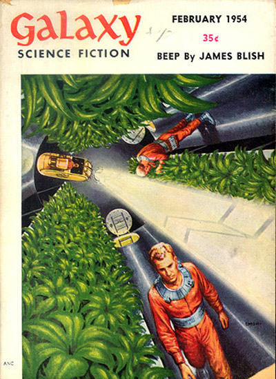
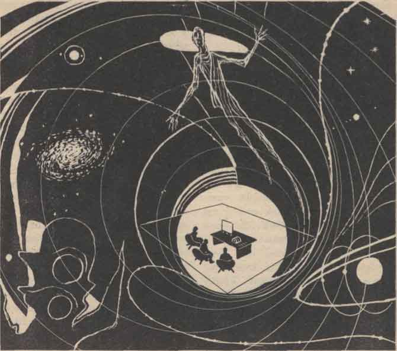

In 1967, the physicist Gerald Feinberg published a quantum-field
analysis of a purely hypothetical class of faster-than-light particles
that he dubbed “tachyons.” This was a rather unorthodox research
project, to say the least. While the possibility of objects moving at
superluminal velocities had been considered since the late nineteenth
century, the impact of Einstein’s 1905 special theory of relativity
seemed to put further study of faster-than-light speed into the realm of
pure science fiction. According to special relativity, it would require
infinite energy to accelerate an object with real mass up to the speed
of light. In other words, as Einstein put it, “superluminary velocities
have no possibility of existence.”[^1] Even were it possible to transmit
signals faster than light, such transmissions could appear to some
observers as having travelled backwards in time, introducing the uncanny
possibility of information from the future influencing past events. Not
only would this violate the principles of physical causality, it could
also lead to certain paradoxes, for example, if messages were to arrive
before they were sent and preempt the sender from sending them. Special
relativity therefore seemed to squash any fantasies of faster-than-light
travel and backwards communications from the future—at least in the
zones of serious science.[^2]

But in 1962, the physicists Oleksa-Myron Bilaniuk, V. K. Deshpande, and
George Sudarshen postulated the existence of subatomic particles that
always travel at superluminal velocities. Such “meta” particles would
never confront the speed of light as an upper barrier because they would
be already beyond it. Moreover, the problem of temporal paradoxes could
be solved by relativistic reinterpretation, insofar as observers in some
frames of reference would perceive such a particle “not as a weird
negative energy particle traveling backward in time, but as a positive
energy particle traveling forward in time, but going in the opposite
direction.”[^3] Likewise, any apparent violations of causality could be
reinterpreted as causal events, as a matter of perspective.

Feinberg, a professor at Columbia University since 1959, was fascinated
by this possibility. Encouraged by his successful prediction of the muon
neutrino in 1958 (its existence was demonstrated in 1962 by his
colleagues Leon Lederman, Melvin Schwartz and Jack Steinberger, who
later shared the Nobel Prize for their work), Feinberg took up the
question of faster-than-light particles with a bold territorial move: he
named them. Rendering them as objects of relativistic quantum field
theory, figuring them as excitations of a quantum field with imaginary
mass, Feinberg also conjured them as objects of discourse: “One
description is presented . . . for noninteracting faster than light
particles, which we call *tachyons*.”[^4] Shortly afterwards, in a
*Scientific American* article introducing tachyons to a wider audience,
Feinberg highlighted the strategic nature of this maneuver: “In
anticipation of the possible discovery of faster-than-light particles, I
named them tachyons, from the Greek word *tachys*, meaning swift.”[^5]
Feinberg’s philological and theoretical production of these speculative
objects ahead of time, I venture, represents a science-fictional way of
doing science, a way of staking claims on the future.

After all, Feinberg was known as much for his intense love of science
fiction as for his prodigious talent as a physicist. When he passed away
in 1992, the obituaries described him as a “devoted scientist and avid
science-fiction fan.”[^6] And sure enough, his work on tachyons was to
some degree indebted to his reading of science fiction. As the physicist
and science fiction writer Gregory Benford recalled, “He told me years
later that he had begun thinking about tachyons because he was inspired
by James Blish’s short story ‘Beep.’ In it, a faster-than-light
communicator plays a crucial role in a future society . . . The
communicator necessarily allows sending of signals backward in time . .
. Feinberg had set out to see if such a gadget was theoretically
possible.”[^7]

While Blish’s 1954 story no doubt piqued Feinberg’s curiosity, I want to
suggest that its value for Feinberg’s own work was less in its technical
provocations than its literary ones. For “Beep” affords an understanding
of theoretical science as equivalent to science fiction: not a purveyor
of mere flights of fancy, but a generator of *consequential fictions*
with the capacity to produce the circumstances of their own
actualization. In other words, they are fictions that become the
conditions of possibility, the *enabling contexts* for discovery and
innovation.

Cover of *Galaxy Science Fiction*, February
1954.

Reading the Future

Blish’s text unfolds as a story within a story. The framing narrative
focuses on the governmental organization known as the Service,
responsible for overseeing the smooth advancement of galactic
civilization. This massive interplanetary operation depends on the
technology of the Dirac communicator. Any message sent through one Dirac
communicator is received instantaneously by all others, preceded by a
small *beep* of sound. In the nested story, concerning the origins of
the communicator, the video commentator Dana Lje discovers that the
“beep is the simultaneous reception of *every one of the Dirac messages
which have ever been sent, or ever will be sent*.”[^8]

The narrative symbolically aligns Lje’s discovery with lies and
illusions—the fictive as such. Her disclosure of the beep’s meaning
depends on an elaborate charade where she poses as a man named J. Shelby
Stevens. On the other hand, Robin Weinbaum, the director of the Service,
is fully aligned with the regime of truth. He represents a government
that does not tolerate fiction: “Just in case you’re not aware of the
fact, there are certain laws relating to giving false information to a
security officer . . . plus various local laws against transvestism,
pseudonymity and so on” (30). Weinbaum demands transparency. He likewise
insists on stripping any obscuring “noise” from otherwise pure signals.
He instructs his assistant to excise the beep: “Margaret, next time you
send any Dirac tapes in here, cut that damnable *beep* off them first”
(23). Weinbaum, agent of truth and law, disregards this literally
preposterous noise. Its meaning only comes to light through Lje’s
fictive performance.

Lje’s process of extracting discrete transmissions from the beep is an
interpretive practice described as reading: “I can read the future in
detail” (31). It apprehends the faster-than-light messages as *texts*,
many of which are strange, mystifying, and unnerving: “Once you know,
however, that when you use the Dirac you’re dealing with time, you can
coax some very strange things out of the instrument” (39). Yet these
“strange things” are recognized as consistent with reality, explicable
by scientific logic. Which is to say, they have the qualities of science
fiction: “She paused and smiled. ‘I have heard,’ she said
conversationally, ‘the voice of the President of our Galaxy, in 3480,
announcing the federation of the Milky Way and the Magellanic Clouds.
I’ve heard the commander of a world-line cruiser, traveling from 8873 to
8704 along the world line of the planet Hathshepa, which circles a star
on the rim of NGC 4725, calling for help across eleven million
light-years—but what kind of help he was calling for, or will be calling
for, is beyond my comprehension. And many other things. When you check
on me, you’ll hear these things too—and you’ll wonder what many of them
mean’” (39).

These vignettes draw from a common repertoire of science fiction
tropes—enormous space ships, intergalactic civilizations, time
travel—and they body forth a sense of wonder and wonderment: “Weinbaum,
already feeling a little dizzy . . . wanted only scenes and voices, more
and more scenes and voices from the future. They were better than
aquavit” (42). Alluring and bewildering, they evade full rational
comprehension even while indicating that such comprehension is
possible—some day: “The farther into the future you travel with the
machine, the more incomprehensible the messages become, and so you’re
reduced to telling yourself that time will, after all, have to pass by
at its own pace, before enough of the surrounding events can emerge to
make those remote messages clear” (39).

The effect of these weird messages from the future is instead a new
perception of the present, namely, as the historical context for
incredible changes to come.[^9] Viewing a beep transmission of a
“green-skinned face of something that looked like an animated traffic
signal with a helmet on it,” Weinbaum exclaims, “And we’ll be using
non-humanoids there! What was that creature, anyhow?” (42). Weinbaum
sees the alien as his own future, albeit radically estranged. This
surprising future puts the present in new light, exposing the humanist
biases of the present (“looked like an animated traffic signal”), even
as it suggests the possibility for things to be otherwise.

The beep is therefore a figure for science fiction as such. While Lje’s
“method of, as she calls it, reading the future” (35) understands the
beep messages to represent inevitable events—evidence for a perfectly
acausal universe—she nevertheless interprets them as self-fulfilling
prophesies: “Since I was going to be married to you [Weinbaum] and
couldn’t get out of it, I set out to convince myself that I loved you.
Now I do” (32). Taking the beep messages seriously, Lje “cooks up
reasons” (33) to ensure they will take place. She invents fictions of
causality (“rationalizations”) that become indistinguishable from actual
causes.

It is a method of reading the future that the Service then implements as
*policy.* In the framing narrative, hundreds of years later, Serviceman
Krasna says: “Our interests as a government depend upon the future. We
operate *as if* the future is as real as the past, and so far we haven’t
been disappointed: the Service is 100% successful. . . . Despite the
evidence that the future is fixed, we have to take on the role of the
caretaker of inevitability . . . we have to act on the philosophy that
history helps only those who help themselves. . . . Our obligation as
Event Police is to make the events of the future possible, because those
events are crucial to our society” (43).

This “as if” approach does not draw a hard line between fact and theory,
truth and lies, science and science fiction.[^10] The Service accepts
the beep messages as if they were reliable prophesies, but treats them
in practice as speculative forecasts that might fail without a vast
technoscientific infrastructure designed to “make the events of the
future possible.” In its role as “Event Police,” the Service assembles
numerous technical resources: “We have some foreknowledge, of course. .
. . But we have obvious other advantages: genetics, for instance, and
operations research, the theory of games, the Dirac transmitter—it’s
quite an arsenal, and of course there’s a good deal of prediction
involved in all those things” (11). Even with knowledge of things to
come, the Service marshals the tools of various scientific disciplines
to turn speculations and “as if” scenarios into lived events.

All of this represents an explicitly *constructivist* approach to truth,
a model for the generation of scientific knowledge that does not excise
science fiction (as Weinbaum once excised the beep), but rather upholds
its crucial role for the advancement of science and society.

As traces of things to come spiral into the present, time travelers and alien laughter from the outer limits converge on the scene of “reading the future.” Illustration from James
Blish, “Beep,” *Galaxy Science Fiction *(February 1954): 58.

Promethean Projections

To the degree that it represents a science-fictional way of governing
the future, the appeal of “Beep” to a “devoted scientist and avid
science-fiction fan” like Feinberg seems obvious in retrospect. The
Service’s decision to reinterpret causally uncertain events in a causal
way, sidestepping potential paradoxes, is tantalizingly similar to the
principle of reinterpretation developed in Feinberg’s own work.
According to Feinberg, actual instrumentation for detecting the
absorption of tachyons from the future would make distinctions between
emission and absorption, sending and receiving, undecideable. Inclined
to causal explanations, an observer would therefore “naturally describe”
the tachyon detector as if it were spontaneously sending signals forward
rather than receiving them from the future.[^11]

For the same reason, Feinberg suggested that a device such as the Dirac
communicator, if taken literally, would not be possible.[^12] The
relevance of “Beep” for thinking about tachyons, however, is more
figural. For the story presents a model of scientific practice and
technological governance that treats physical theories and
interpretations of data as fictions, but not “mere” fictions; rather,
the Dirac messages become the conditions for further experimentation,
triggering additional research and decisive actions. They are science
fictions that enable their own materialization in the form of
consequential practices.

Feinberg offered a similar perspective in his writings on tachyons:
“Having convinced ourselves that the existence of faster-than-light
particles does not imply any contradiction of relativity, we must
nevertheless leave the determination of whether such objects really
happen in nature to the experimental physicist.”[^13] Feinberg here
presents tachyons as consequential fictions that galvanize
experiments—no more, no less. To be sure, they have provoked numerous
studies and experiments over the last half-century. Even failure to
prove their existence has led to new theoretical interpretations. For
example, we could point to the “tachyonic field” concept in quantum
field theory, taken to mathematically indicate field instabilities
rather than real particles. We could also point to the abiding hope for
faster-than-light signals—a hope projected always into the future—as
suggested in some recent research on quantum tunneling, or more
tellingly, in the premature 2011 declaration by scientists at CERN that
they had discovered neutrinos traveling faster than light (a claim later
disproved).[^14]

Yet even as they generate such experimental adventures, tachyons have
not ceased to be understood as science-fictional objects. Already in
1970, Feinberg conceded that experimental results seemed to suggest that
tachyons are not actually real, but to him, this only further
demonstrated the value of such entities. After all, it may be likely
that “tachyons simply do not exist . . . [but] we may not understand why
it should be so until we reach a much deeper understanding of the nature
of elementary particles than now exists.”[^15] Which is to say, as
nothing otherwise than science fictions, they indicate the degree to
which extant physical theories are themselves provisional and
constructed, prone to change in the future.

In 1968, this forward-looking perspective also led Feinberg to write an
ambitious book called *The Prometheus Project: Mankind’s Search for
Long-Range Goals*. Here, he presented a scheme for reshaping social
organization in order to achieve futuristic science-fiction visions. In
effect, he proposed establishing an Event Police, governing the future
in the image of science fiction.

But that is another story . . .

[^1]: Albert Einstein, “On the Electrodynamics of Moving Bodies,” in
    *The Collected Papers of Albert Einstein, Volume 2: The Swiss Years:
    Writings, 1900-1909* (English Translation) (Princeton: Princeton
    University Press, 1989), 170.

[^2]: On the history of faster-than-light communication theories and
    time-travel scenarios, see Paul J. Nahin, *Time Machines: Time
    Travel in Physics, Metaphysics, and Science Fiction*, 2nd ed. (New
    York: Springer-Verlag, 1999).

[^3]: O. M. P. Bilaniuk, V. K. Deshpande, and E. C. G. Sudarshan,
    “‘Meta’ Relativity,” *American Journal of Physics* 30 (1962): 2. For
    reflections on this foundational work and later developments, see
    Oleksa-Myron Bilaniuk, “Tachyons,” *Journal of Physics: Conference
    Series* 196 (2009).

[^4]: Gerald Feinberg, “Possibility of Faster-Than-Light Particles,”
    *Physical Review* 159/5 (1967): 1090.

[^5]: Gerald Feinberg, “Particles That Go Faster Than Light,”
    *Scientific American* 222/2 (1970): 70.

[^6]: Leyla Kokmen, “Prof. Dies after Fight with Cancer,” *Columbia
    Spectator* (April 23 1992).

[^7]: Gregory Benford, “Old Legends,” in *New Legends*, ed. Greg Bear
    and Martin H. Greenberg (New York: Tor, 1995), 276.

[^8]: James Blish, “Beep,” *Galaxy Science Fiction* 7/5 (1954): 6-54,
    quote on 36. Further page citations appear parenthetically.

[^9]: Fredric Jameson has argued that science fiction’s “multiple mock
    futures serve the quite different function of transforming our own
    present into the determinate past of something yet to come. . . . SF
    thus enacts and enables a structurally unique ‘method’ for
    apprehending the present as history”; Fredric Jameson,
    *Archaeologies of the Future: The Desire Called Utopia and Other
    Science Fictions* (New York: Verso, 2005). This is one aspect of
    cognitive estrangement, famously described by Darko Suvin in
    *Metamorphoses of Science Fiction: On the Poetics and History of a
    Literary Genre* (New Haven: Yale University Press, 1979).

[^10]: See Michael Saler, *As If: Modern Enchantment and the Literary
    Prehistory of Virtual Reality* (Oxford: Oxford University Press,
    2012).

[^11]: Feinberg writes, “Therefore, while it does appear possible to
    construct kinematic closed cycles using tachyons in which signals
    are sent back to the past, a careful examine of the methods of
    detection, with due regard to the interpretation of absorption of
    negative-energy tachyons as emission of positive-energy tachyons,
    leads to the conclusion that such closed cycles will not be
    interpreted as reciprocal signaling, but rather as uncorrelated
    spontaneous emission”; Feinberg, “Possibility of Faster-Than-Light
    Particles,” 1103. Though such reinterpretation of faster-than-light
    phenomena was first suggested by the work of Bilaniuk, Deshpande,
    and Sudarshen, it is now generally called the “Feinberg
    reinterpretation principle.”

[^12]: Feinberg writes, “A conclusion warranted by this argument is that
    tachyons cannot be used to send reliable signals, either forward or
    backward in time, in the sense that one cannot completely control
    the outcome of an experiment to produce or absorb them”; Feinberg,
    “Possibility of Faster-Than-Light Particles,” 1092.

[^13]: Feinberg, “Particles That Go Faster Than Light,” 72.

[^14]: See Günter Nimtz, “Tunneling Confronts Special Relativity,”
    *Foundations of Physics* 41/7 (2011); E. Kapuścik and R. Orlicki,
    “Did Günter Nimtz Discover Tachyons?,” *Annalen der Physik* 523/3
    (2011); and T. Adam, et al. (OPERA collaboration), “Measurement of
    the Neutrino Velocity with the OPERA Detector in the CNGS Beam,”
    arXiv:1109.4897v1 (17 November 2011).

[^15]: Feinberg, “Particles That Go Faster Than Light,” 77.

