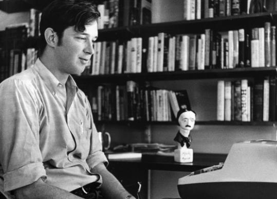

“Relentlessly suspenseful . . . A hair-raising experience”

- The Pittsburgh Press

“Hideously plausible suspense . . . [that] will glue you to your chair”

- Detroit Free Press

“Science fiction, which once frightened because it seemed so far-out, now frightens because it seems so near. The <em>Andromeda Strain</em> is as matter-of-fact as the skull-and-crossbones instructions on a bottle of poison—and just as chillingly effective”

- Life<a href="#fn1" class="footnoteRef" id="fnref1">1</a>

The decades following World War II saw an unprecedented increase in the scale and scope of science. These developments generated new dreams as well as new nightmares about the potential for science to reshape the order of things. These changes also gave birth to science studies, a discipline that emerged to understand how political power and social life was reconfigured by “big science” and vice versa.<a href="#fn2" class="footnoteRef" id="fnref2">2</a> One of the most prolific and influential interpreters of these changes is a writer often dismissed as too big, too bestselling, too popular, to be taken seriously by either science or science studies: Michael Crichton. His massive commercial success has prevented him from being recognized as part of a literary tradition that includes H.G. Wells, Edgar Allen Poe, and Arthur Conan Doyle, all of whom profoundly shaped ideas about science as well as its practice by inhabiting spaces of ambiguity between the possible and the actual.

Crichton, born in 1942 in Chicago and raised in Roslyn, NY, himself grew big—as an adult he measured 6 foot 9 inches—along with American science. But even when he was small, Crichton was an apt pupil of these earlier authors’ literary practices. Beginning in the 1960s, he adapted them for the primary arenas of late 20th century mainstream American culture—a media environment inhabited by blockbuster novels, film, and prime time TV. His body of work, which includes major contributions to each of those genres, is a rich and deep archive for exploring the production and circulation of the fears and fantasies that swirl around and often suffuse science. It is similarly valuable for understanding the emergence and maturation of science studies.

A huge part of the appeal of Crichton’s work has been its intimate and subversive relationship to science “fact.” I am tentative about the word here because it is one that science studies scholars have been interrogating for about as long as Crichton has been writing. Indeed, the form and tone of Crichton’s stories track closely to shifts in academic science studies: he recreates the world in which scientists work, devoting specific attention to the practices, instruments, and values that animate their knowledge production enterprise. These are worlds of compromise, impurity, and commercial and political imperatives. They are worlds of uncertainty, breakdown, and human error. Most of all, there are worlds in which knowledge is up for grabs. Crichton’s stories are philosophical and polemical, asking time and again how it is that humans who struggle understand each other in the most banal ways can be so confident in their ability to master nature.

<figcaption>Crichton at his desk during his time at Harvard Medical School. His 1969 “Edgar” award for <em>A Case of Need</em> sits nearby. (Julian Brown for The Boston Globe/ 1969 file; <a href="http://www.boston.com/bostonglobe/obituaries/articles/2008/11/06/michael_crichton_66_wrote_jurassic_park_created_er/?page=full">source</a>).
</figcaption>

Becoming a writer was, he said in his <a href="http://www.michaelcrichton.net/books-travels.html">1988 autobiography</a>, “his earliest life ambition.” It took him a while, however, to embrace it as his professional identity.

Though he enrolled at Harvard as an English major, when he got a B- on a paper (which he claims was written by George Orwell but submitted as Crichton’s own work as a jab at his Professor), he switched to anthropology and studied with William White Howells. <a href="http://www.nytimes.com/2005/12/30/national/30howells.html?_r=0">Howells was celebrated</a> for his scholarship on craniometry as well as for the trade books he wrote about human origins, with titles like <a href="books.google.com/books/about/Mankind_So_Far.html?id=IQIFAAAAMAAJ"><em>Mankind So Far</em></a> (1944). Before abandoning academia for medicine—he received an MD from Harvard, as well—Crichton taught introduction to anthropology at Cambridge and published scholarly articles based on researching using skulls stored at the British Museum in London, England.<a href="#fn3" class="footnoteRef" id="fnref3">3</a>

During this time, he financed his education by writing <a href="blogs.wsj.com/speakeasy/2013/08/11/michael-crichtons-secret-life-reprinted-in-paperback">pulpy mysteries</a> under the pseudonym John Lange. He wrote the book, <a href="books.google/com/books/about/A_Case_of_Need.html?id=CiJQnVQ8P2PAC"><em>A Case of Need</em></a> (1968)—a thinly veiled critique of Harvard Medical School—under the pen name Jeffrey Hudson.

Under his own name Crichton soon established his beat as a reporter of the near future, the possible but not yet actual. In doing so, he connected with heterogeneous reading publics who had come to accept the ubiquity of what science studies scholars now refer to as “technoscience” in everyday life but who did not often possess the same kind of privileged access to the circumstances of its production.<a href="#fn4" class="footnoteRef" id="fnref4">4</a>

Crichton honed his literary voice by blending conventions from his own clinical observations, the dialogue-heavy New Journalism that was taking hold via authors like Joan Didion and Tom Wolfe, and the gothic fiction of a century prior. He became celebrated for his ability to combine meticulous attention to authenticating detail about the practices and procedures that characterized professional work as well as the middle-class dreams that made that work seem meaningful, with more sensational speculation about how science could go horribly wrong. His first major science fiction publication was the biomedical thriller, <a href="http://www.michaelcrichton.net/books-andromedastrain-history.html"><em>The Andromeda Strain</em></a> (1969), which he wrote while in medical school. Soon after director Robert Wise <a href="http://www.imbd.com/title/tt0066769">made the novel into a movie</a> (1971), a combination that proved to be archetypal of the niche Crichton would occupy and exploit in decades to come.

<em>The Andromeda Strain</em> was a story of biological crisis—the introduction of a mysterious and deadly viral agent upon the return of a space voyage—at a time when many were still fixated on the threat of nuclear crises. In the novel, a military satellite returns to earth, landing in northern Arizona. The team sent to recover the satellite breaks radio contact. Because the military suspects an infection, they dispatch a new team of scientists to investigate, only to find that everybody in the nearest small town is dead (except for an old man and a screaming infant). The survivors are taken to an underground laboratory where the organism, named the “Andromeda Strain” is identified and nearly kills all of mankind.

Published weeks before the <a href="#.VLAXId7Zj8E">lunar landing of Apollo 11</a>, <em>The Andromeda Strain</em> played on the fear that astronauts would bring new germs back to earth. Crichton subsequently attributed the idea for the plot to the paleontologist George Gaylord Simpson. While studying anthropology at Harvard, Howells tasked Crichton with reporting on Simpson’s (1953) <em>The Major Features of Evolution.</em><a href="#fn5" class="footnoteRef" id="fnref5">5</a> He recalled being struck by a footnote, where the famed evolutionary theorist disparagingly observed that microbes in the upper atmosphere had never been used as the subject of a science fiction story. Simpson had, at the time, been embroiled in debates with Nobel laureate Joshua Lederberg over the subject of exobiology.<a href="#fn6" class="footnoteRef" id="fnref6">6</a>

Legendary editor Bob Gottlieb (he “discovered” Joseph Heller and published <em>Catch-22</em>) also saw potential in such a story and guided the book to publication at Knopf. He encouraged Crichton to write the novel in the <a href="http://www.sarahweinman.com/confessions/2008/11/the-art-of-edit.html">style of a <em>New Yorker</em> profile</a>, aiming for a cool, detached voice that towed the line between fiction and reality. In the novel, Crichton highlighted then new technologies like remote surveillance, voice activated systems, computer imaging and diagnosis, handprint identification, and biosafety procedures. The hazmat suit, which is now commonplace visual signifier of biocontamination, made its public debut in the film, as did Crichton, who appeared in a small role. His depiction of cutting-edge innovations made it difficult for readers to disentangle the actual from the merely possible—heightening the thrill. The plausibility of his account was meant to leave people in a perpetual state of suspense, a nightmare-like trance that might not be that different from being awake.

<figure>

</figure>

<figcaption>
Screen shot of <a href="https://www.youtube.com/watch?v=8qEsqjJAY-k">Andromeda Strain movie trailer</a> (Universal Pictures, 1971).
</figcaption>

In the years the followed, both the phrase and the concept of an <a href="https://books.google.com/books?isbn=1134584466">“Andromeda strain”</a> became linked with emerging infectious diseases including AIDS, Marburg, and Ebola, appearing both in news coverage of epidemics as well as in biomedical publications and political speech. Crichton was <a href="http://www.michaelcrichton.net/essay-playboy-panicinthesheets.html">not then comfortable</a> positioning himself as a commentator on these new diseases, though he later acknowledged that the novel was one of the first popular works to suggest that biological science was growing and that it might supplant physics and nuclear power as a source of controversy and curiosity.

Initially, Crichton insisted that his work was about science, not politics—as though they could be separated. Nevertheless, in 1969, as the Cold War was at its peak, the Russian edition of <em>The Andromeda Strain</em> was reviewed as radical, left-wing, anti-American, and anti-military. The same book was, at home, reviewed as a right wing, elite, hand-maiden to the military. Some charged that his depiction of a viral threat might inspire the creation of bioweapons. This heterogeneous yet charged reception of his work established Crichton as a lightening rod for political controversy.<a href="#fn7" class="footnoteRef" id="fnref7">7</a>

The runaway success of <em>The Andromeda Strain</em> encouraged Crichton to abandon his medical career—about which he was already deeply ambivalent—and to invest fully in the literary genre that became synonymous with his name: the “technothriller.” Along with authors like <a href="http://www.jgrisham.com/">John Grisham</a> and <a href="http://www.tomclancy.com">Tom Clancy</a>, the technothriller is part of a genealogy that includes Peter George’s <a href="books.google.com/books/about/Red_Alert.html?id=BsQujWhUII0C"><em>Red Alert</em></a> (1958), Richard Condon’s <a href="https://books.google.com/books?isbn=140912990X"><em>Manchurian Candidate</em></a> (1959), and Eugene Burdick and Harvey Wheeler’s <a href="https://books.google.com/books?isbn=088001654X"><em>Fail Safe</em></a> (1962)—all of which subsequently became movies. Crichton’s work in this genre includes more than a dozen best-selling novels, multiple blockbuster films, video games, and the award-winning medical drama, <a href="http://www.nbc.com/er">ER.</a>

Much like his peers in science studies, Crichton’s primary sources were scientific books and journals . . . which he cited in reference sections at the backs of his novels. He was also an adept interviewer and did not hesitate to use his connections to institutions like Harvard and the <a href="http://www.salk.edu">Salk Institute</a>, where he worked for a year as a post-doc while writing <em>Andromeda Strain</em>. (<a href="press.princeton.edu/titles/2417.html">Sociologists Bruno Latour and Steve Woolgar</a> arrived a decade later.) Crichton imbued this robust base of technical detail with a prophetic sense of impending disaster. Why did scientists choose to focus on these details and not others? How would their inscriptions travel in the wider world? What might go wrong? What already had?

Crichton died of liver cancer in 2008 but works continue to be released in his name. Take, for example <a href="http://www.michaelcrichton.net/books-micro.html"><em>Micro</em></a> (2011), a manuscript that was completed by Richard Preston. (<em>Micro</em> followed Crichton’s tried and true of convention of team of experts confronting science gone amok. This time, the team got a new stock figure: the anthropologist of science. A citation to Latour in the novel’s bibliography suggests Crichton’s fiction continued to keep pace with the anthropological turn in science studies.) In the wake of the most recent Ebola epidemic, Preston’s own non-fiction Ebola thriller <a href="richardpreston.net/preston-books/hot-zone"><em>The Hot Zone</em></a> (1994) returned to the best-seller list. Despite criticisms from the world of public health that Preston was sensationalist, others, <a href="http://www.newyorker.com/magazine/2014/10/27/ebola-wars">including the New Yorker</a>, embraced Preston as a leading expert on the potential impact of the disease, publishing his dispatches from Sierra Leone under a title, “The Ebola Wars,” that was a throwback to <em>Andromeda Strain</em>.

It is possible to quantify Crichton’s influence in terms of dollars—<a href="articles.latimes/com/2010/mar/12/entertainment/la-et-crichton-collection-2010mar12">in the hundreds of millions</a>. But it is a more challenging and rewarding task to reckon with the ways in which his speculative writings and their filmic depictions have shaped the ways policy makers, students, and even scientists themselves, have conceived of what is thrilling—both sublime and grotesque—about emerging technoscience.

Tracing the life histories of Crichton’s big science fiction stories gives credence to the suggestion that <a href="books.google/com/books/about/The_Dreams_Our_Stuff_is_Made_Of.html?id=0meRTMfDOt4C">science fiction colonizes the future</a>; that a subset of those who write it and who read it resolve and actively redefine the boundary between fantasy and reality. What we need to understand this phenomenon, to understand the history of technoscience, are biographies of science fiction authors and, perhaps more urgently, biographies of the products of their creative endeavors. Among the themes that recur in Crichton’s works are ideas about the relationship between machine and nature, science and capitalism, wonder and fear, fraud and corruption, humility and hubris. These are the dreams and nightmares our science is made of—as well as our history and anthropology of science. It’s time to wake up to the reality of fiction.

<section class="footnotes">

<ol>
<li id="fn1">
Each of these is a blurb from reviews of <em>The Andromeda Strain </em><a href="#fnref1">↩</a>
</li>
<li id="fn2">
Peter Louis Galison and Bruce William Hevly, <em>Big Science : The Growth of Large-Scale Research</em> (Stanford: Stanford University Press, 1992); Derek de Solla Price, <em>Little Science, Big Science</em> (New York: Columbia University Press, 1963).<a href="#fnref2">↩</a>
</li>
<li id="fn3">
William White Howells and J. M. Crichton, <em>Craniometry and Multivariate Analysis</em>, 57/1 (Cambridge, MA: Harvard Peabody Museum, 1966); Stanley John Olsen, et al., <em>Craniometry and Multivariate Analysis</em> 57/2 (Cambridge, MA: Harvard Peabody Museum, 1970).<a href="#fnref3">↩</a>
</li>
<li id="fn4">
Following Gaston Bachelard, <em>La materialisme rationel</em> (Paris: PUF, 1953) and developed with in science studies initially by Donna Haraway and Bruno Latour.<a href="#fnref4">↩</a>
</li>
<li id="fn5">
George Gaylord Simpson, <em>The Major Features of Evolution</em> (New York: Columbia University Press, 1953).<a href="#fnref5">↩</a>
</li>
<li id="fn6">
Audra Wolfe, &quot;Germs in Space,&quot; <em>Isis</em> 93/2 (2002): 183-205.<a href="#fnref6">↩</a>
</li>
<li id="fn7">
<a href="../customXml/item1.xml">http://www.michaelcrichton.net</a>.<a href="#fnref7">↩</a>
</li>
</ol>
</section>

